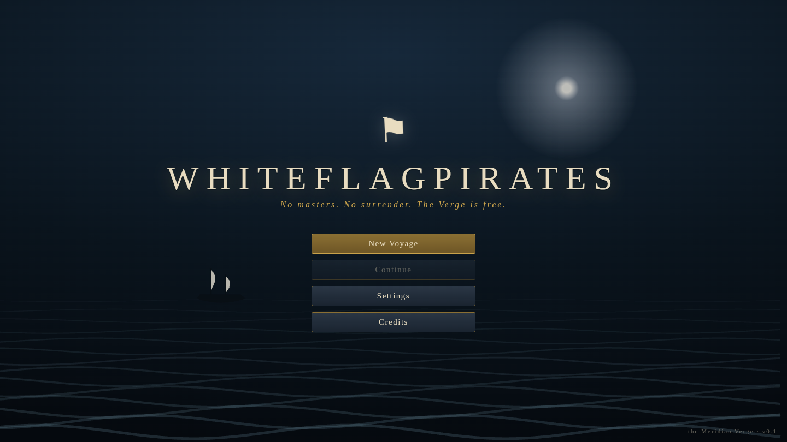
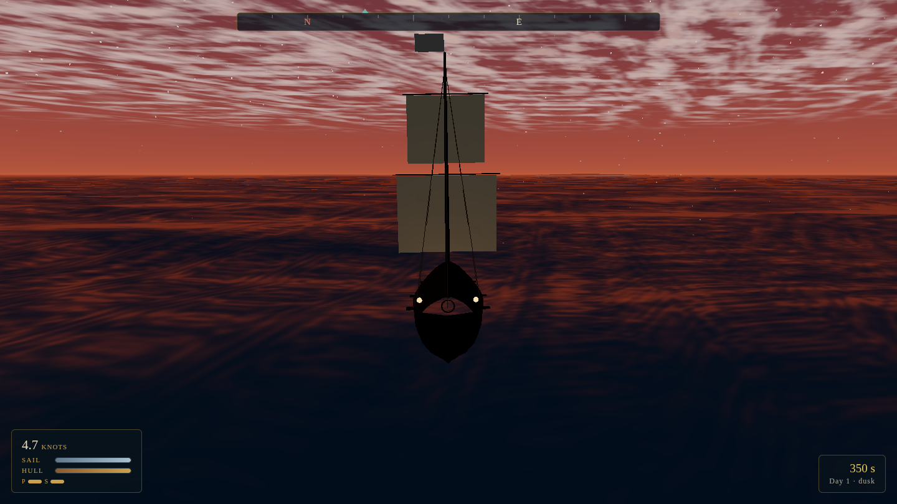
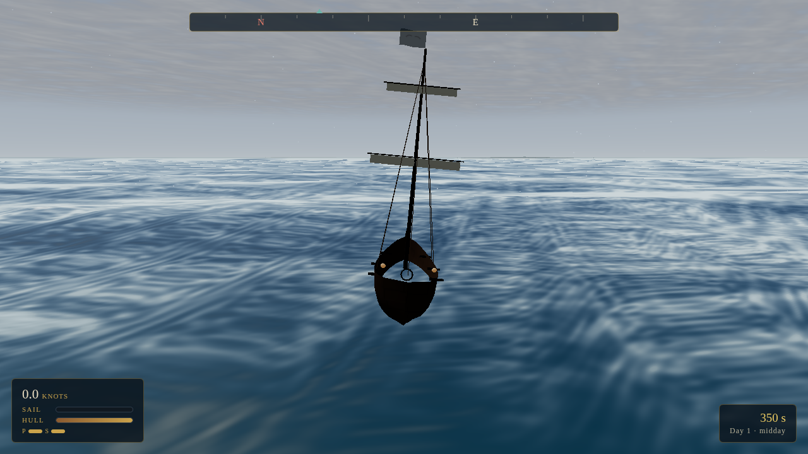
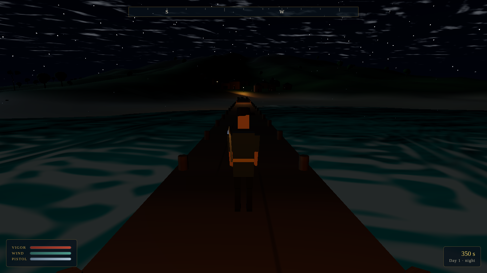
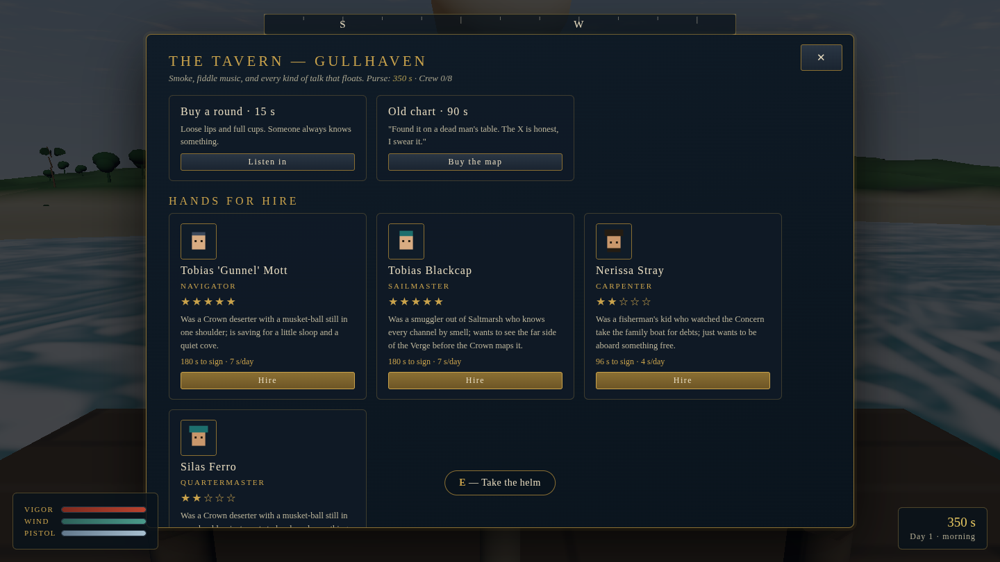

# ⚑ WhiteFlagPirates

*No masters. No surrender. The Verge is free.*

**WhiteFlagPirates** is an original open-world pirate action-adventure set in the
**Meridian Verge** — a vast procedurally-realized fantasy archipelago of twelve
authored islands, contested by four factions. You are **Captain Wren Kestrel**,
last signatory of the Pale Accord, sailing under a white flag that means freedom,
not surrender.

Built entirely with **three.js** — every mesh, texture, sound, and note of music
is generated procedurally at runtime. No asset files.



| | |
|---|---|
|  |  |
| *Golden hour on the open sea* | *A squall darkens the Verge* |
|  |  |
| *Lantern-lit dock after dark* | *Hiring crew at the Drowned Lantern* |

## Play

```bash
npm install
npm run dev      # then open the printed URL
```

Production build: `npm run build && npm run preview`.

## What's in the game

- **A living ocean** — GPU Gerstner wave simulation (physics-matched on CPU so
  ships truly ride the swells), crest and shoreline foam, sun glint, storm seas.
- **Dynamic sky & weather** — full day/night cycle, atmospheric dawn/dusk,
  procedural stars and moon, clouds, rain, storms with lightning and thunder.
- **Twelve islands** — volcanic peaks, jungles, mangrove mazes, bone-white
  atolls, reef labyrinths — each with authored lore, and five living ports with
  distinct faction architecture.
- **Six ship classes** — sloop to galleon, procedurally modeled with billowing
  cloth sails, rigging, and faction flags; wind-aware sailing physics with
  tacking, heel, and anchor work.
- **Naval combat** — round/chain/grape shot, staggered broadsides, enemy
  captains that patrol, trade, hunt, flee, and turn to present their guns;
  boarding actions resolved by your crew's steel.
- **On-foot adventure** — third-person exploration of ports and islands, sword
  combat (combos, parries, dodges, pistol), NPCs with roles and rumors,
  treasure maps and buried hoards, shipwreck diving.
- **Systems that talk to each other** — dynamic port economies, crew hiring and
  morale, faction reputation (anger the Crown and hunters sail), skill trees,
  ship upgrades, dynamic encounters, five-chapter main story.
- **A nautical interface** — parchment world chart, captain's journal, compass
  ribbon, trading posts, taverns, shipwrights.
- **Procedural audio** — synthesized ocean/wind/rain ambience, cannon thunder,
  and a generative shanty-flavored score that follows the mood.

## Controls

| Input | At sea | On foot |
|---|---|---|
| W / S | trim sails up / down | move |
| A / D | rudder | strafe |
| Mouse | camera | camera |
| RMB (hold) | aim broadside | parry |
| LMB | fire | sword (hold = heavy) |
| 1 / 2 / 3 | round / chain / grape shot | — |
| Space | anchor | jump / dodge |
| Shift | — | sprint |
| F | — | pistol |
| E | dock / collect | interact / dig |
| Q | spyglass | — |
| M / J / K / Tab | chart / journal / skills / crew & cargo | same |
| Esc | pause | pause |

## Project layout

```
src/core/      engine, input, events, state, shared math (frozen contracts)
src/data/      islands, factions, goods, quests, lore — the authored world
src/world/     ocean, sky, weather, clouds, terrain, vegetation, ports
src/ship/      ship classes, procedural shipwright, sailing physics
src/combat/    effects, naval combat, enemy fleet AI
src/character/ humanoid rig, player controller, sword combat, NPCs, wildlife
src/systems/   economy, crew, quests, treasure, progression, encounters
src/ui/        HUD, chart, menus, trading, journal
src/audio/     synthesized SFX, ambience, generative music
docs/          game design document & module contracts
```

## Development docs

- [Game Design Document](docs/GDD.md)
- [Module Contracts](docs/CONTRACTS.md)

Headless smoke test (requires Chromium): `npm run build && npm run preview &`
then `node scripts/playtest.mjs http://localhost:4173/ shots`.
